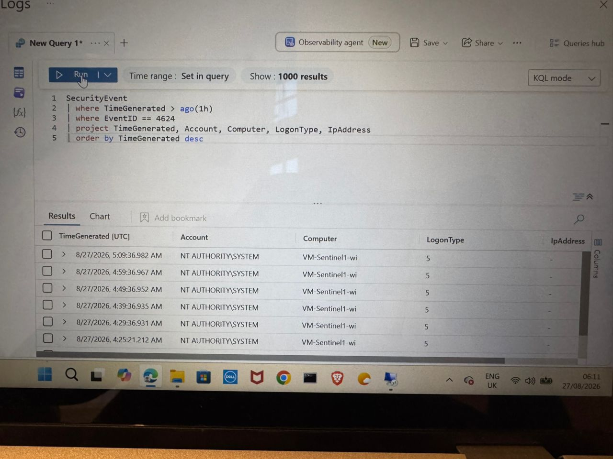
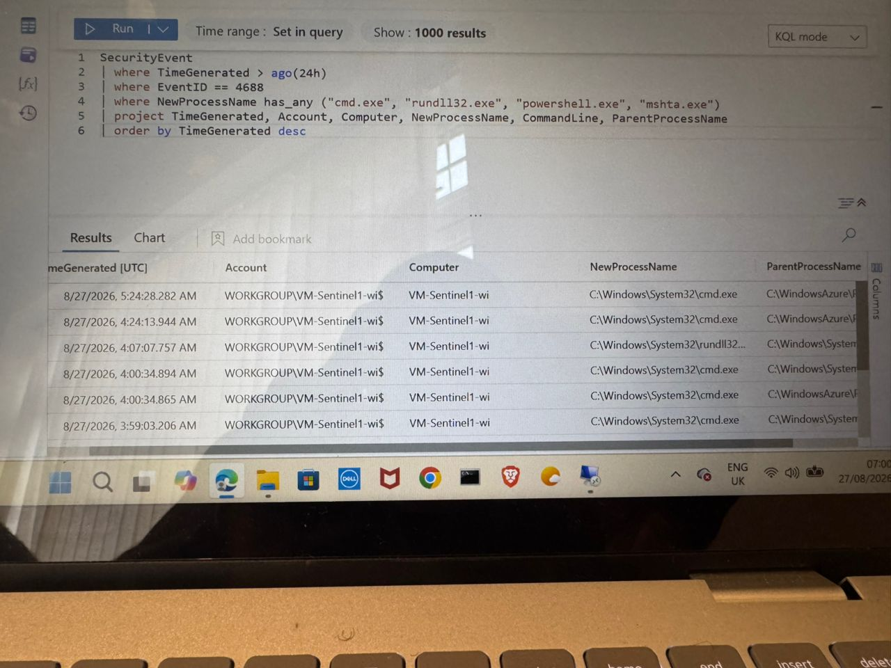
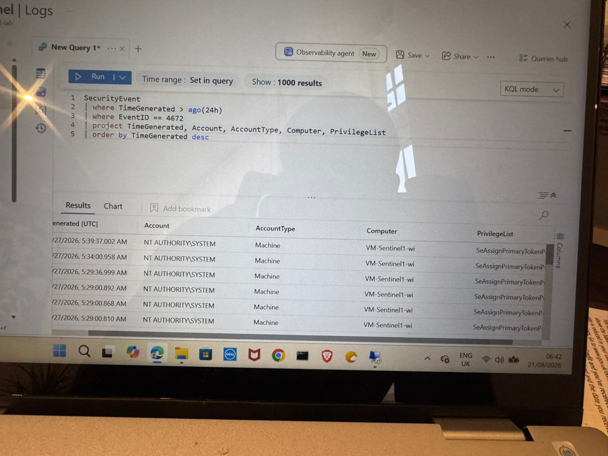
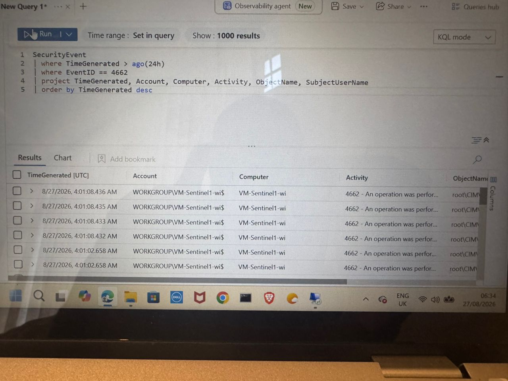

# SOC Sentinel Lab

## Overview

This repository documents my hands-on cybersecurity SOC lab using Microsoft Sentinel.

The lab focuses on security monitoring, Windows Security Events, KQL (Kusto Query Language), and basic incident investigation.

## Objectives

- Investigate Windows security events
- Write and use KQL queries
- Analyse authentication activity
- Investigate process creation events
- Identify potentially suspicious activity
- Develop SOC investigation and documentation skills

## Tools

- Microsoft Sentinel
- Kusto Query Language (KQL)
- Windows Security Events
- Microsoft Azure

## Investigations

This repository will contain KQL queries, investigation notes, and supporting screenshots from my SOC lab.

More investigations will be added as I progress.

### Evidence

A screenshot of the Microsoft Sentinel query results showing Windows Event ID 4624 successful logon events.

## Investigation 2: Windows Event ID 4688 – Process Creation

### Findings

Event ID 4688 represents a Windows process creation event.

The query was used to identify process creation activity involving potentially interesting executables, including cmd.exe, rundll32.exe, powershell.exe, and mshta.exe.

The results show multiple process creation events on the VM-Sentinel1-wi computer. The observed processes include cmd.exe and rundll32.exe.

These processes are not automatically malicious, but their execution should be reviewed in context using the command line, parent process, account, and timing.

### Field Analysis

- **TimeGenerated** – Time when the process creation event was recorded.
- **Account** – User account associated with the process.
- **Computer** – Computer where the process was created.
- **NewProcessName** – Name and path of the newly created process.
- **CommandLine** – Command-line arguments used to start the process.
- **ParentProcessName** – Process that started the newly created process.

### Investigation Notes

The query filters Windows Event ID 4688 and searches for commonly monitored process names.

The results can be reviewed to determine which account created the process, which computer was involved, what process was created, the command line used, and which parent process launched it.

The presence of cmd.exe or rundll32.exe does not by itself confirm malicious activity. Additional investigation is required to determine whether the process execution was expected or suspicious.

### Evidence

A screenshot of the Microsoft Sentinel query results showing Windows Event ID 4688 process creation events.

## Investigation 3: Windows Event ID 4672 - Special Privileges

### Findings

Event ID 4672 represents a Windows security event where special privileges are assigned to a new logon.

The query was used to identify accounts receiving special privileges on the monitored Windows computer.

The results show multiple Event ID 4672 events associated with the `NT AUTHORITY\SYSTEM` account on the `VM-Sentinel1-wi` computer.

The account type is shown as `Machine`, and the observed privilege list includes `SeAssignPrimaryTokenPrivilege`.

The observed activity is associated with the SYSTEM account and does not by itself confirm malicious activity. The account, privileges, timing, and surrounding events should be reviewed when determining whether the activity is expected.

### Field Analysis

- **TimeGenerated** - Time when the Event ID 4672 event was recorded.
- **Account** - Account associated with the privileged logon.
- **AccountType** - Type of account associated with the event.
- **Computer** - Computer where the event occurred.
- **PrivilegeList** - Special privileges assigned during the logon.

### Investigation Notes

The query filters Windows Event ID 4672 and displays the account, account type, computer, and privilege information.

The results show repeated privileged events for `NT AUTHORITY\SYSTEM` on `VM-Sentinel1-wi`. The presence of a privileged event alone does not establish malicious activity and should be assessed in context.

### Evidence

A screenshot of the Microsoft Sentinel query results showing Windows Event ID 4672 special privilege events.

## Investigation 4: Windows Event ID 4662 - Directory Service Access

### Findings

Event ID 4662 represents an operation performed on an object.

The query was used to identify Windows Event ID 4662 activity and review the associated account, computer, activity, object name, and subject user.

The results show multiple Event ID 4662 events on the `VM-Sentinel1-wi` computer. The account shown is `WORKGROUP\VM-Sentinel1-wi$`.

The observed activity occurred around 04:01 AM on 27/08/2026, and the ObjectName values shown begin with `root\CIM`.

The presence of Event ID 4662 events does not by itself confirm malicious activity. The account, object accessed, activity, timing, and surrounding events should be reviewed to determine whether the activity was expected.

### Field Analysis

- **TimeGenerated** - Time when the event was recorded.
- **Account** - Account associated with the event.
- **Computer** - Computer where the activity occurred.
- **Activity** - Description of the operation performed.
- **ObjectName** - Object associated with the operation.
- **SubjectUserName** - User associated with the activity.

### Investigation Notes

The query filters Windows Event ID 4662 and displays the main fields needed to investigate object access activity.

The results show repeated events associated with the machine account `WORKGROUP\VM-Sentinel1-wi$` on `VM-Sentinel1-wi`. Further investigation would be required to determine the purpose and context of the `root\CIM` object activity.

### Evidence

A screenshot of the Microsoft Sentinel query results showing Windows Event ID 4662 activity.

